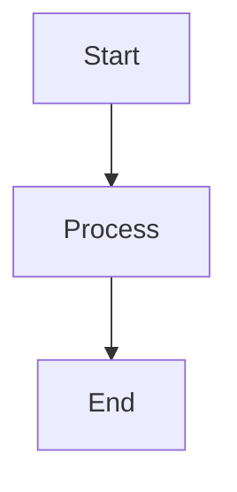
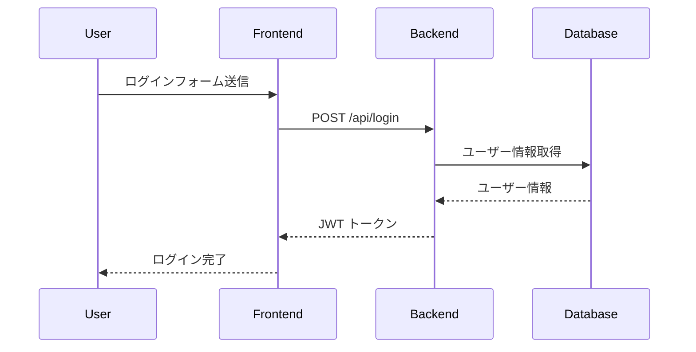
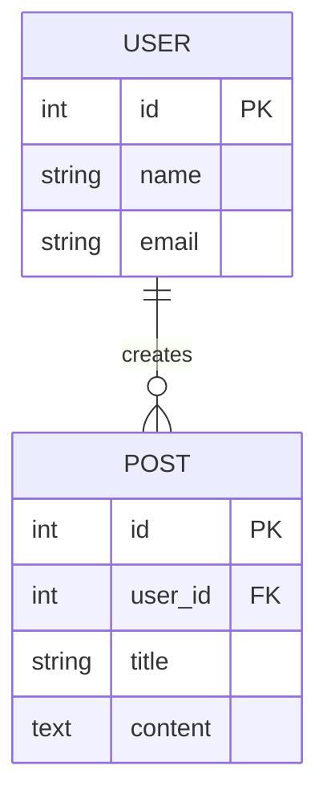
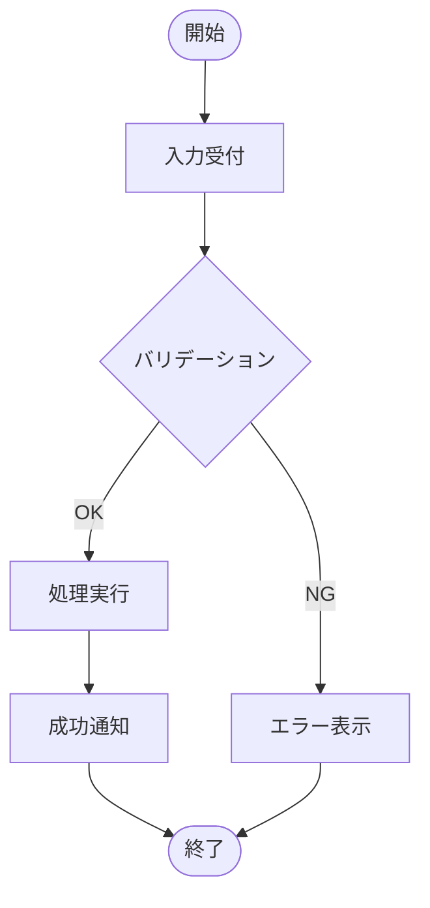

# 図表・ダイアグラム

このディレクトリには、設計図やダイアグラムを保存します。

## ファイル命名規則
```
[種類]-[対象].png/svg/mmd
```

### 例
- `er-diagram.png` - ER図
- `architecture-overview.svg` - アーキテクチャ図
- `user-flow.png` - ユーザーフロー図
- `sequence-login.mmd` - ログインシーケンス図（Mermaid）

## 図表の種類

### アーキテクチャ図
システム全体の構成を示す図

- `architecture-overview.svg`
- `architecture-backend.svg`
- `architecture-frontend.svg`

### ER図（Entity-Relationship）
データベース設計を示す図

- `er-diagram.png`
- `er-users-posts.png`

### シーケンス図
処理の流れを時系列で示す図

- `sequence-login.mmd`
- `sequence-payment.mmd`

### フローチャート
ビジネスロジックの流れを示す図

- `flow-order-process.png`
- `flow-approval.png`

### ユーザーフロー
ユーザーの操作フローを示す図

- `user-flow-registration.png`
- `user-flow-checkout.png`

## 推奨ツール

### Mermaid（テキストベース）


ファイル拡張子: `.mmd`

### Draw.io / diagrams.net
GUIで図を作成

エクスポート: SVG推奨（`.svg`）

### PlantUML
テキストベースのUML作成

ファイル拡張子: `.puml`

## Mermaid例

### シーケンス図


### ER図


### フローチャート


## ドキュメントへの埋め込み

### Markdownで参照
```markdown
## システムアーキテクチャ


```

### Mermaidの埋め込み
```markdown
## ログインシーケンス

​```mermaid
sequenceDiagram
    User->>Frontend: Login
    Frontend->>Backend: Auth
​```
```

## バージョン管理

- 図を更新する際は、旧バージョンを削除せず別名で保存
  - 例: `er-diagram-v1.png`, `er-diagram-v2.png`
- 最新版は `-latest` を付けるか、バージョン番号なしで保存

## 関連ドキュメント

- [アーキテクチャ](../architecture.md)
- [仕様書](../仕様書.md)
